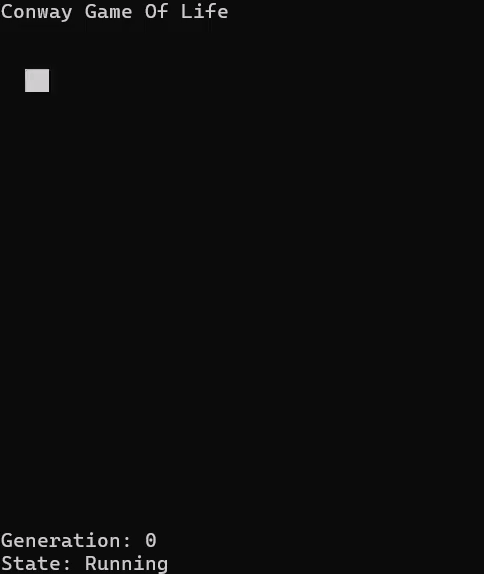

# Cellular Automata Engine

Небольшой движок для реализации и исследования двумерных клеточных автоматов на Python.

Первоначально проект был создан в рамках тестового задания по реализации **Conway's Game of Life**, однако в процессе разработки архитектура была расширена до основы для различных клеточных автоматов с разделением симуляции, правил автомата и пользовательского интерфейса.

## Демонстрация


## Возможности

* двумерное поле клеточного автомата;
* поддержка тороидального пространства;
* ручное редактирование состояния клеток;
* пошаговое выполнение симуляции;
* история поколений с возможностью возврата назад;
* определение состояний симуляции:
  * обычное выполнение;
  * отсутствие активных клеток;
  * стабильная конфигурация;
  * циклическая конфигурация;
* интерактивный консольный интерфейс.

## Поддерживаемые автоматы

На текущий момент поддерживается:

* **Conway's Game of Life (B3/S23)**

Архитектура позволяет добавлять новые бинарные клеточные автоматы через конфигурации правил рождения и выживания (B/S).

Например, Conway's Game of Life описывается правилами:

- Birth: 3
- Survive: 2, 3

или в стандартной записи: B3/S23.

## Архитектура

Проект разделён на несколько уровней:

```
engine/               игровой цикл и управление состоянием
simulation/           управление симуляцией
  cellular_automata/  логика клеточных автоматов
      common/         общие компоненты, системы и конфигурации
      presets/        готовые конфигурации автоматов
ui/                   пользовательский интерфейс
```

Состояние клеток хранится с использованием собственной ECS-архитектуры.

Клетка состоит из компонентов:
* `Position` — координаты клетки;
* `State` — текущее состояние.

Логика изменения состояний вынесена в отдельные системы (`Systems`), а описание конкретного автомата задаётся через конфигурации и пресеты.

Такое разделение позволяет добавлять новые автоматы без изменения игрового цикла и пользовательского интерфейса.

## Управление
> Управление использует английскую раскладку клавиатуры.

| Клавиша   | Действие                  |
|-----------|---------------------------|
| ← ↑ ↓ →   | Перемещение курсора       |
| Space     | Изменить состояние клетки |
| Enter     | Следующее поколение       |
| Backspace | Предыдущее поколение      |
| Q         | Выход                     |

## Особенности реализации

В отличие от классического варианта задания, при обнаружении терминального состояния программа не завершает работу.

При достижении:
* отсутствия активных клеток;
* стабильной конфигурации;
* циклической конфигурации;

текущее состояние сохраняется и позволяет продолжить исследование или редактирование поля.

## Запуск

Требуется Python 3.10 или новее.

Установка зависимостей:
```bash
pip install -r requirements.txt
```

Запуск:
```bash
python main.py
```
Для Windows также доступен готовый исполняемый файл, собранный с помощью PyInstaller.